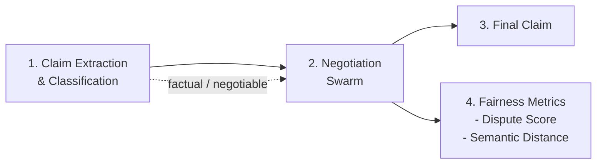
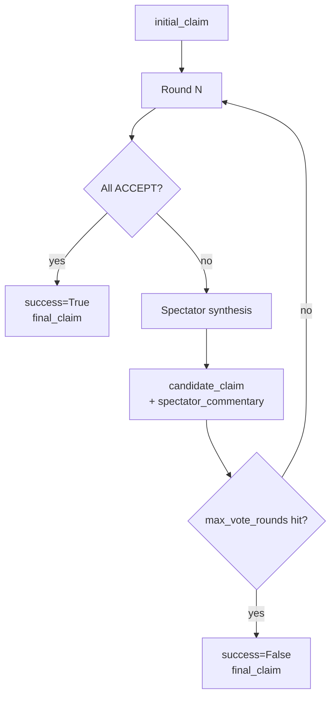
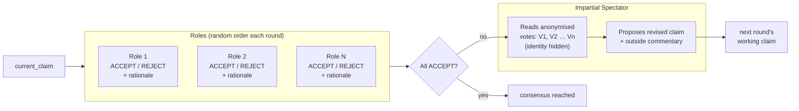

# Rawlsian Agents: LLM-Based Contract Negotiation & Fairness Assessment

An implementation of **Rawlsian Agents** based on [Rawlsian Agents: An Application of Large Language Models (LLM) to Forge Fairer Bilateral Agreements](https://link.springer.com/chapter/10.1007/978-3-032-15632-7_1) and [its original codebase](https://github.com/aegerita/Rawlsian-Agents). This system uses LLMs to analyze, discuss, and redraft contracts through multi-agent simulated debate, measuring initial contract fairness via negotiation metrics.

## Architecture Overview



### Pipeline Stages

1. **Claim Extraction & Classification** – Parse contract text and classify claims as *factual* or *negotiable*.
2. **Negotiation Swarm** – DSPy vote-and-rewrite loop over a claim until unanimous consensus or `max_vote_rounds` is reached:
   - Each role casts an `ACCEPT` or `REJECT` vote with rationale (random order each round).
   - An impartial spectator reads anonymised vote feedback and proposes a revised claim plus one outside-perspective commentary.
   - Loop exits on unanimity or after `max_vote_rounds` (default 10).
3. **Negotiation Output** – Return the final claim plus a full audit trail:
   - `success`, `final_claim`, `spectator_commentary`
   - `rounds` (full per-round record), `rounds_count`

## Prerequisites

- Python 3.13
- OpenAI-compatible API (e.g. OpenAI, Nebius AI) for chat **or** a local open-source LLM (see below)

## Optional: Tavily MCP for Web Docs Search

If you want AI tooling in your editor to query live web docs, this workspace includes a starter MCP config:

- `.vscode/mcp.json`

Setup steps:

1. Get a Tavily API key from [tavily.com](https://www.tavily.com/).
2. Put your key in `.env` as `TAVILY_API_KEY=...` (or export it in your shell).
3. Export the variables into your shell before launching the editor:

```bash
set -a
source .env
set +a
code .
```

4. Restart your MCP-compatible client/editor if it was already open.

The included configuration uses Tavily's remote MCP endpoint through `mcp-remote`.

## Dependency Management (uv)

This project uses [pyproject.toml](pyproject.toml) and [uv.lock](uv.lock) for dependency management.

Install dependencies:

```bash
uv sync
```

Add a dependency:

```bash
uv add <package>
```

Add a dev dependency:

```bash
uv add --dev <package>
```

### Installing the Package

After running `uv sync`, install the package in development mode to make `rawlsianagents` importable:

```bash
uv pip install -e .
```

### Shared Git Hooks (Recommended)

This repository includes a tracked pre-commit hook at [.githooks/pre-commit](.githooks/pre-commit) so all developers use the same checks.

Enable it once per clone:

```bash
git config core.hooksPath .githooks
```

The hook runs before each commit:

- `isort .`
- `ruff check . --fix`

## View Documentation Locally

Build the Sphinx docs:

```bash
uv run make -C docs html
```

Windows-native command, run from repo root:
```bash
uv run sphinx-apidoc --force --no-toc --separate -o docs/api src/rawlsianagents
uv run sphinx-build -b html docs docs/_build/html
```

- The `html` target depends on `apidoc` (`html: apidoc`), so it runs first.
- `apidoc` calls `sphinx-apidoc` to regenerate API `.rst` stubs in `docs/api` from `src/rawlsianagents`.
- This keeps API pages aligned with the current Python modules before HTML generation.

Then either open the generated file directly:

- `docs/_build/html/index.html`

Or serve the docs folder locally with Python:

```bash
cd docs/_build/html
python -m http.server 8000
```

If you want to regenerate API stubs manually only:

```bash
uv run sphinx-apidoc --force --no-toc --separate -o docs/api src/rawlsianagents
```

Open:

- `http://localhost:8000`

### Optional: Local Open-Source LLM (Ollama / vLLM)

Run the negotiation examples with a **local** OpenAI-compatible server (e.g. [Ollama](https://ollama.com), vLLM, Hugging Face Inference) instead of a cloud API.

- Set `USE_LOCAL_LLM=1` (or `true` / `yes`) in `.env`.
- Then run the examples normally (for example, `python examples/negotiate_claim.py`).

Configure in `.env`:

| Variable | Default | Description |
|----------|---------|-------------|
| `LOCAL_LLM_BASE_URL` | `http://localhost:11434/v1` | OpenAI-compatible API base (Ollama default) |
| `LOCAL_LLM_MODEL` | `glm-4.7-flash` | Chat model name (Ollama pull name or your server's model id) |
| `LOCAL_EMBEDDING_MODEL` | `nomic-embed-text` | Embedding model (Ollama or local embed server) |
| `LOCAL_LLM_API_KEY` | (empty) | Optional; Ollama ignores it |

**Example (Ollama):**

First, install Ollama:
```bash
curl -fsSL https://ollama.com/install.sh | sh
```

Then pull the models:
```bash
ollama pull glm-4.7-flash
ollama pull nomic-embed-text
```

Update `.env`:
```bash
USE_LOCAL_LLM=1
LOCAL_LLM_BASE_URL=http://localhost:11434/v1
LOCAL_LLM_MODEL=glm-4.7-flash
LOCAL_EMBEDDING_MODEL=nomic-embed-text
```

## Usage

### Quick Start: Negotiation Swarm

The `NegotiationSwarm` module provides a simple way to negotiate claims among multiple parties:

```python
from rawlsianagents import NegotiationSwarm

roles = ["LeVan family", "bride", "groom", "potential children"]
initial_claim = (
    "The marriage contract excludes all of the husband's business interests "
    "from net family property and limits the wife's right to support."
)

swarm = NegotiationSwarm(
    roles=roles,
    initial_claim=initial_claim,
    max_vote_rounds=10,  # optional, default is 10
)

result = swarm.negotiate()
print(f"Final claim: {result['final_claim']}")
print(f"Completed in {result['rounds_count']} rounds")
print(f"Success: {result['success']}")
```

See [examples/negotiate_claim.py](examples/negotiate_claim.py) for more examples. For generated API docs, build Sphinx docs and open `docs/_build/html/index.html`.

### Current NegotiationSwarm Behavior

**Outer loop** — one iteration per round:



**Inner round** — the democratic voting process:



- Constructor: `NegotiationSwarm(roles, initial_claim, max_vote_rounds=10)`
- Each role evaluates only `current_claim` and `spectator_commentary` — no history.
- Roles use `dspy.ChainOfThought(RoleVote)` and vote `ACCEPT` or `REJECT` with a rationale.
- Spectator uses `dspy.ChainOfThought(SpectatorSynthesis)` and receives anonymised vote IDs (V1, V2, …) to prevent identity bias.
- Spectator outputs a revised `candidate_claim` and a free-text `spectator_commentary` for the next round.
- Role order is re-randomised each round via `random.sample(roles)`.

Return payload of `negotiate()` / `negotiate_async()`:

| Key | Type | Description |
|-----|------|-------------|
| `success` | `bool` | Whether unanimous consensus was reached |
| `final_claim` | `str` | Accepted or last candidate claim |
| `spectator_commentary` | `str` | Last spectator outside perspective |
| `rounds` | `list[NegotiationRound]` | Full per-round audit trail |
| `rounds_count` | `int` | Number of voting rounds run |

### Pipeline Usage

### Run Claim Extraction Example

```bash
python examples/extract_claims.py
```

Runs the extraction/classification workflow over the included sample inputs.

### Run Negotiation Swarm Example

```bash
python examples/negotiate_claim.py
```

Runs the DSPy vote-and-rewrite loop and prints the final claim plus audit trail.

## Environment

Copy [.env.template](.env.template) to `.env` and fill in your values:

```bash
cp .env.template .env
```

Required:
- `OPENAI_API_KEY` for OpenAI-compatible endpoint

Optional:
- `USE_LOCAL_LLM=1` and `LOCAL_LLM_*` for a local open-source LLM (Ollama / vLLM / Hugging Face Inference)

## File Layout

```
RawlsianAgents/
├── README.md
├── pyproject.toml         # Dependencies (uv)
├── .python-version        # Python toolchain pin
├── .env.template          # Environment template
├── data/                  # Sample agreements and inputs
├── src/
│   └── rawlsianagents/
│       ├── __init__.py            # Exports: NegotiationSwarm
│       ├── config.py              # LLM config (cloud vs local)
│       ├── claims_extractor.py    # Claim extraction & classification
│       ├── negotiation_swarm.py   # DSPy vote-and-rewrite loop
│       └── utils/
│           ├── __init__.py        # Utility exports
│           └── metrics.py         # Cross-encoder semantic distance
├── examples/
│   ├── negotiate_claim.py         # Example: negotiation swarm
│   ├── extract_claims.py          # Example: claim extraction
│   ├── distribution_analysis.py   # Example: dispute score distribution
│   └── tier3_verbose.py           # Example: verbose tier 3 run
├── docs/
│   ├── index.rst                  # Sphinx entrypoint
│   ├── modules.rst                # API module index
│   └── api/                       # API rst pages (auto-generated)
└── uv.lock                # Locked dependency graph
```

## Key Concepts

### Fairness Metrics

- **Dispute Score** = `total_rounds / num_negotiable_claims`  
  Higher scores indicate more initial injustice or ambiguity.
  
- **Per-Claim Dispute Score** = `rounds_for_claim_i`  
  Identifies the most contentious clauses.

- **Semantic Distance** = `distance(initial_claim, final_claim)`  
  Computed with the cross-encoder metric utility; higher values indicate greater semantic drift.

## References

- [Rawlsian Agents: An Application of Large Language Models (LLM) to Forge Fairer Bilateral Agreements](https://link.springer.com/chapter/10.1007/978-3-032-15632-7_1)
